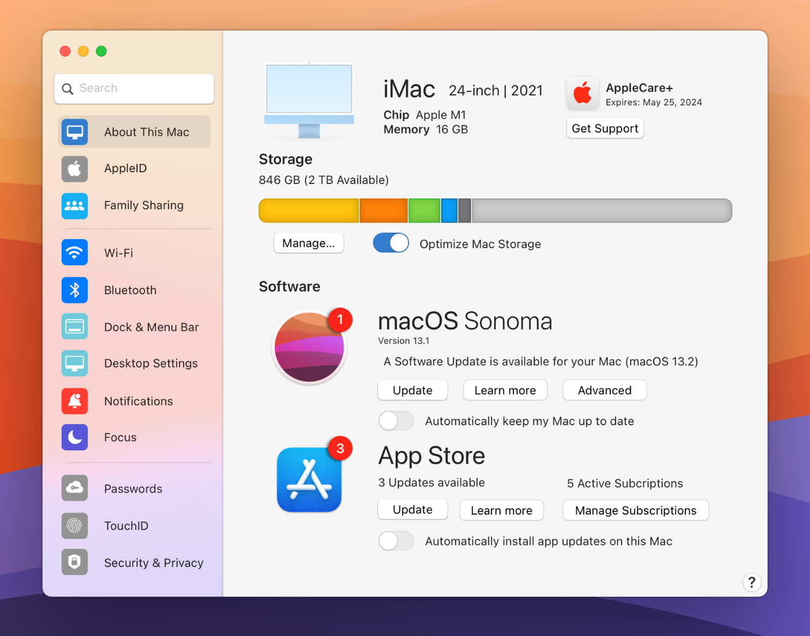

# Frontend Take-home Exercise

```
TIMEBOX:    2-3 hours (recommended)
LANGUAGES:  Typescript (NOT Javascript)
FRAMEWORKS: React and any other libraries you want

```

## Overview

This exercise is mean to test your ability to build a simple frontend application. The things we are looking at are included in the list below. We are not looking for a perfect solution, but we are looking for a solution that is well thought out and shows your ability to take a design and turn it into a working application.

```
1. The implemented solution matches the design
2. The code is well structured and easy to read
3. The code is well tested
4. The code is well documented
5. Linting & Formatting tools

```

## Prompt

Below is an image from https://basicappleguy.com/basicappleblog/settingsapp



The goal is to build a simple web page that looks like the above image. The settings page should have the following features:

## Hint on icons

Check out https://icons8.com/ for icons and free illustrations. Feel free to use any icons that closely match the ones in the image.

## Submitting your exercise

```
1. Please create a private repo on Github and add the following users as collaborators:
2. Include a README.md file with instructions on how to run your application
3. Maintain a commit history that shows your progress
```

## Bonus Points

```
1. Deploy your application to a public URL
2. Setup a CI/CD pipeline to automatically deploy your application to a public URL
3. Add a feature that is not in the design
```

## Real Flex

```
1. Use vanilla JS/CSS (no frameworks)
```
